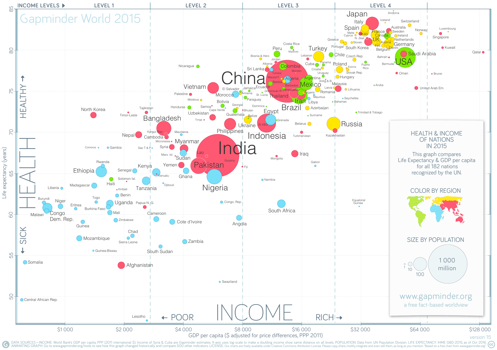

<!-- Definir as opções para todos os chuncks do doc: -->
<!-- Biblioteca p criar sumário de dados: library(summarytools) -->
```{r setup, include=FALSE}
knitr::opts_chunk$set(echo = TRUE, fig.align= "center")
#library(gt)

library(summarytools)
st_options(
  plain.ascii= FALSE,
  dfSummary.varnumbers= FALSE,
  dfSummary.style= "grid",
  dfSummary.graph.magnif= .75
)

library(tidyverse)
theme_set(                               
  theme_linedraw() +                     # Set simple theme for ggplot
    theme(                               # with some tweaks
      axis.title.y.left= element_text(   
        angle= 0,                        # Never rotate y axis title
        margin= margin(r= 20),          # Separate y axis title a little
        vjust= .5                        # Leave y axis title in the middle
      ),
      axis.title.x.bottom= element_text(
        margin= margin(t= 20)            # Separate x axis title a little
      ),
      axis.line= element_blank(),        # No axis lines
      panel.border= element_blank(),     # No frame
      panel.grid.minor= element_blank()  # No grid minor lines
    )
)

```

```{js javascript-init, echo= FALSE}

//Make off-site links open in a new wondow/tab
function changeTargets() {
  $("a").attr(
    "target", function(){
      // Load local links locally
      if(this.host== location.host) return "_self"
      // Load off-site links in a new window
      else return "_blank";
    }
  );
}

// Execute when document is ready
$(
  changeTargets
)
```

# Visualização com `ggplot2` 

## Exemplo 




<!-- Para mostrar uma imagem a sintaxe é  -->

## Mapeamento estético (*mapping*) e geometrias

No exemplo:

<!-- ::: Determina que as informações estarão num bloco -->
<!-- Largura 50% e margem automática = tabela não ocupa a linha inteira e fica centralizada. CSS margem autom centraliza obj na horizontal -->

::: {style="width: 50%; margin: auto;"}

| Variável            | Estética  | Geometria |
|---------------------|-----------|-----------|
| PIB per capita      | posição x | ponto     |
| Expectativa de vida | posição y | ponto     |
| População           | tamanho   | ponto     |
| Continente          | cor       | ponto     |

:::

Algumas outras estéticas:

* Cor de preenchimento
* Cor do traço
* Tipo do traço (sólido, pontilhado, tracejado etc.)
* Forma (círculo, quadrado, triângulo etc.)
* Opacidade


Algumas outras geometrias:

* Linhas
* Barras ou colunas
* *Boxplots*
* Histogramas

## Escalas (*scale*)

Controlam os detalhes do mapeamento (eixos, cores etc.).

## Rótulos (*labels*)

Texto.


## Outros componentes

* Coordenadas
* Temas
* Legendas (*guides*)
* Facetas

# Conjunto de dados

Dados sobre o sono de diversos mamíferos. Vamos ver a documentação:

<!-- Este conjunto de dados já vem no Tidyverse -->

```{r help}
?msleep
```


Atribuir à variável `df` o *data frame*, que faz parte do pacote `ggplot2` (que já foi carregado no *chunk* de *setup*, lá em cima):

```{r df}
df <- msleep
df
```

Examinar a estrutura --- usando R base:

```{r str-df}
str(df)
```

Usando `glimpse`:

<!-- Função glimpse faz basicamente a mesma coisa que a função str -->

```{r glimpse-df}
glimpse(df)
```

Vendo só as primeiras linhas:

```{r head-df}
head(df)
```

Interativamente, usando `view`:

<!-- Mostra os dados numa planilha interativa -->

```{r view-df}
view(df)
```

Sumário dos dados usando o pacote *summarytools* (que já foi carregado no *setup*):

<!-- %>% é um comando chamado pipe que que tiver do lado esquerdo dele é enviado pra função do lado direito dele. pipe leva df pra dentro da função dfSummary e depois leva dfSummary pro print -->

```{r summary-df}
df %>% dfSummary() %>% print(method = 'render')
```

Muitos `NA` em diversas variáveis. Para nossos exemplos simples de visualização, vamos usar as colunas

* `name` 
* `genus` 
* `order` 
* `vore`
* `sleep_total` 
* `awake` 
* `bodywt` 
* `brainwt` 

Mas... a coluna que mostra a dieta (`vore`) tem só 7 `NA`. Quais são?

 <!-- df>> filtar(linhas)>> is.na=retorna V ou F >> resultado pro select(que seleciona colunas) >> exibe nomes  -->


```{r df-vore}
df %>% 
  filter(is.na(vore)) %>% 
  select(name)
```

OK. Vamos manter a coluna `vore` também, apesar dos `NA`. Quando formos usar esta variável, tomaremos cuidado.

Também... a coluna `bodywt` tem 0 como valor mínimo. Como assim?

<!-- Filtrar > peso corporal > nome e peso corporal >  arrange ordena o resultado em ordem crescente -->

```{r df-bodywt}
df %>% 
  filter(bodywt < 1) %>% 
  select(name, bodywt) %>% 
  arrange(bodywt)
```

Ah, sem problema. A função `dfSummary` arredondou estes pesos para 0. Os valores de verdade ainda estão na *tibble*.

Vamos criar uma *tibble* nova só com as colunas que nos interessam:

```{r sono}
sono <- df %>% 
  select(name, order, genus, vore, bodywt, brainwt, awake, sleep_total)
```

# Gráficos de dispersão (*scatter plots*)

* Servem para visualizar a *relação* entre duas variáveis quantitativas.

* Essa relação *não* é necessariamente de causalidade. 

* Isto é, a variável representada no eixo horizontal não determina, necessariamente, os valores da variável representada no eixo vertical.
  
* Pense em associação, correlação, não em causalidade.

* Troque as variáveis de eixo, se ajudar a deixar isto claro.

## Horas de sono e peso corporal

Como as variáveis `sleep_total` e `bodywt` estão relacionadas?

sono>> ggplot >>mapeamento estético(aes)>> 


```{r sono-peso-plot-1}
sono %>% 
  ggplot(aes(x = bodywt, y = sleep_total))
```

O que houve? Cadê os pontos?

O problema foi que só especificamos o mapeamento estético. Faltou a geometria.

<!-- sono>> ggplot >> estética >> geometria(geometria_point) -->
<!-- ggplot tem que usar o + pra concatenar inves do pipe -->

```{r sono-peso-plot-2}
sono %>% 
  ggplot(aes(x = bodywt, y = sleep_total)) +
    geom_point()
```


A única coisa que percebemos aqui é que os mamíferos muito pesados dormem menos de 5 horas por noite.

Estes animais muito pesados estão estragando a escala do eixo $x$.

Que animais são estes?

```{r pesados}
sono %>% 
  filter(bodywt > 250) %>% 
  select(name, bodywt) %>% 
  arrange(bodywt)
```

Além disso, há muitos pontos sobrepostos. Em bom português, *overplotting*. 

Existem diversas maneiras de lidar com isso.

A primeira delas é alterando a opacidade dos pontos:

<!-- alpha= opacidade -->

```{r sono-peso-plot-alfa}
sono %>% 
  ggplot(aes(x = bodywt, y = sleep_total)) +
    geom_point(alpha = 0.2)
```

Outra maneira é usar `geom_jitter` em vez de `geom_point`:

<!-- jitter= sacode os pontos aleatoriamente -->

```{r sono-peso-plot-jitter}
sono %>% 
  ggplot(aes(x = bodywt, y = sleep_total)) +
    geom_jitter(width = 100, alpha = 0.5)
```

Vamos mudar a escala do gráfico para nos concentrarmos nos animais menos pesados:

<!-- escala> eixo que quer modificar> se é contínua ou não > limites do eixo x são 0 e 200 -->

```{r sono-peso-plot-3}
sono %>% 
  ggplot(aes(x = bodywt, y = sleep_total)) +
    geom_point() +
    scale_x_continuous(limits = c(0, 200))
```

Nesta escala, a relação entre horas de sono e peso não é mais tão regular.

## Horas de sono e peso corporal para animais pequenos

Vamos restringir o gráfico a animais com no máximo 5kg.

```{r limite}
limite <- 5
```

Em vez de mudar a escala do gráfico, vamos filtrar as linhas do *data frame*:

```{r sono-peso-plot-pequenos}
sono %>% 
  filter(bodywt < limite) %>% 
  ggplot(aes(x = bodywt, y = sleep_total)) +
    geom_point()
```


## Incluindo a dieta

```{r plot-sono-peso-dieta}
sono %>% 
  filter(bodywt < limite) %>% 
  ggplot(aes(x = bodywt, y = sleep_total, color = vore)) +
    geom_point()

```

## A estética pode ser especificada na `geom`

```{r plot-sono-peso-dieta-geom}
sono %>% 
  filter(bodywt < limite) %>% 
  ggplot() +
    geom_point(aes(x = bodywt, y = sleep_total, color = vore))
```

## Estética fixa ou dependendo de variável?

Compare o último chunk acima com:

```{r plot-sono-peso-cor}
sono %>% 
  filter(bodywt < limite) %>% 
  ggplot() +
    geom_point(aes(x = bodywt, y = sleep_total), color = 'blue')
```

Um erro comum:

```{r plot-sono-peso-cor-erro}
sono %>% 
  filter(bodywt < limite) %>% 
  ggplot() +
    geom_point(aes(x = bodywt, y = sleep_total, color = 'blue'))
```

## Uma correlação mais clara

Peso cerebral versus peso corporal:

```{r cerebro-corpo}
sono %>% 
  ggplot() +
    geom_point(aes(x = bodywt, y = brainwt))
```

Vamos restringir aos animais mais leves e mudar a opacidade:

```{r cerebro-corpo-2}
sono %>% 
  filter(bodywt < limite) %>% 
  ggplot() +
    geom_point(aes(x = bodywt, y = brainwt), alpha = .5)
```

Vamos incluir horas de sono e dieta:

```{r cerebro-corpo-3}
sono %>% 
  filter(bodywt < limite) %>% 
  ggplot() +
    geom_point(
      aes(
        x = bodywt, 
        y = brainwt,
        size = sleep_total,
        color = vore
      ), 
      alpha = .5
    )
```

Mudar a escala dos tamanhos e incluir rótulos:

```{r cerebro-corpo-4}
sono %>% 
  filter(bodywt < limite) %>% 
  ggplot() +
    geom_point(
      aes(
        x = bodywt, 
        y = brainwt,
        size = sleep_total,
        color = vore
      ), 
      alpha = .5
    ) +
    scale_size(
      breaks = seq(0, 24, 4)
    ) +
    labs(
      title = 'Peso do cérebro versus peso corporal',
      subtitle = paste0('para mamíferos com menos de ', limite, ' kg'),
      caption = 'Fonte: dataset `msleep`',
      x = 'Peso corporal (kg)',
      y = 'Peso do\n cérebro (kg)',
      color = 'Dieta',
      size = 'Horas\nde sono'
    )
```


 <!-- scale_size(  ## tamanho da escala -->
 <!--      breaks = seq(0, 24, 4)  ## divisões de 0 a 24 de 4 em 4 -->
 <!--    ) + -->
 <!--    labs(   #rótulos -->
 <!--      title = 'Peso do cérebro versus peso corporal', -->
 <!--      subtitle = paste0('para mamíferos com menos de ', limite, ' kg'), -->
 <!--      caption = 'Fonte: dataset `msleep`',  ## fonte dos dados -->
 <!--      x = 'Peso corporal (kg)', -->
 <!--      y = 'Peso do\n cérebro (kg)', -->
 <!--      color = 'Dieta', -->
 <!--      size = 'Horas\nde sono' -->


